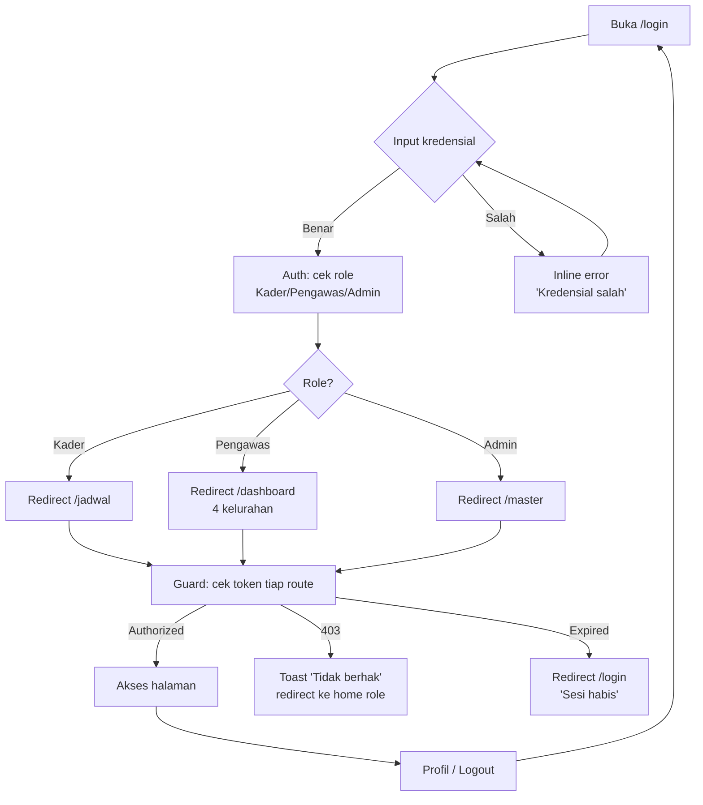
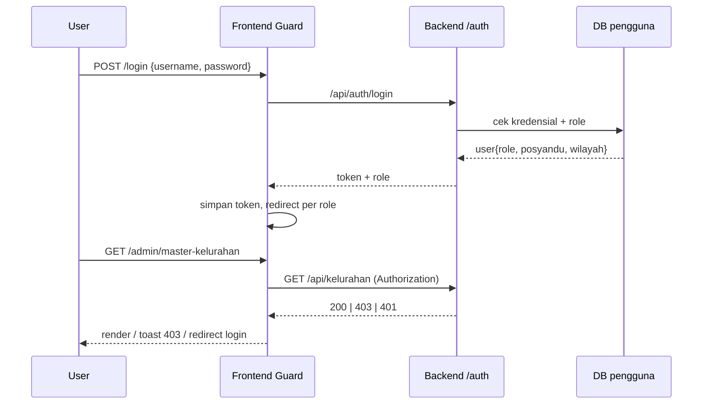

# W-A — Auth & Guard (Semua Role)

> Alur login 3 peran: Kader, Pengawas (Bu Dian), Admin. Guard peran + redirect + session.

## User Journey

| Step | Aktor | Aksi | Keluaran |
|---|---|---|---|
| 1 | Semua | Buka `/login` | Form kredensial |
| 2 | Semua | Input username+password | Validasi |
| 3 | System | Auth + role middleware | Token + role |
| 4 | System | Redirect per role | Kader→`/jadwal`, Pengawas→`/dashboard`, Admin→`/master` |
| 5 | Semua | Buka `/profil` | Lihat/ubah password, No HP |
| 6 | Semua | Logout / session expiry | Kembali ke `/login` |

## Diagram Mermaid — Flow



## Diagram Mermaid — Sequence Guard



## Skenario Gherkin

```gherkin
Feature: Auth & Guard 3 peran

  Scenario: Login sukses sebagai Kader
    Given akun Kader "kader_a" aktif dengan posyandu Ngemplakrejo RW04
    When input username "kader_a" dan password benar
    Then redirect ke "/jadwal" dan guard izinkan GET "/api/kunjungan?milik=saya"

  Scenario: Login sukses sebagai Pengawas
    Given akun Pengawas "bu_dian" aktif
    When login benar
    Then redirect ke "/dashboard" dan bisa lihat 4 kelurahan

  Scenario: Kredensial salah
    Given akun ada
    When input password salah
    Then inline error "Kredensial salah" dan tetap di "/login"

  Scenario: Akses terlarang Kader ke Master
    Given login sebagai Kader
    When buka "/admin/master-kelurahan"
    Then 403 + toast "Tidak berhak" dan redirect ke "/jadwal"

  Scenario: Session habis
    Given token kedaluwarsa saat buka "/dashboard"
    When guard cek Authorization
    Then redirect ke "/login" dengan pesan "Sesi habis, silakan login kembali"

  Scenario: Logout
    Given login sebagai Admin
    When klik Logout
    Then token dihapus dan redirect ke "/login"

  Scenario: Ganti password di Profil
    Given login sebagai Kader
    When buka "/profil" dan ganti password dengan konfirmasi benar
    Then toast "Password diperbarui" dan tetap login
```

## Catatan

- 3 peran + wilayah binaan Kader → dipakai guard W-E (Kader hanya wilayahnya).
- Online only: tidak ada simpan token offline khusus; expiry ditangani guard.
