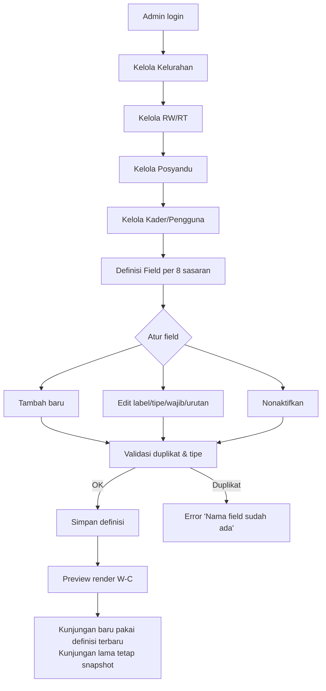
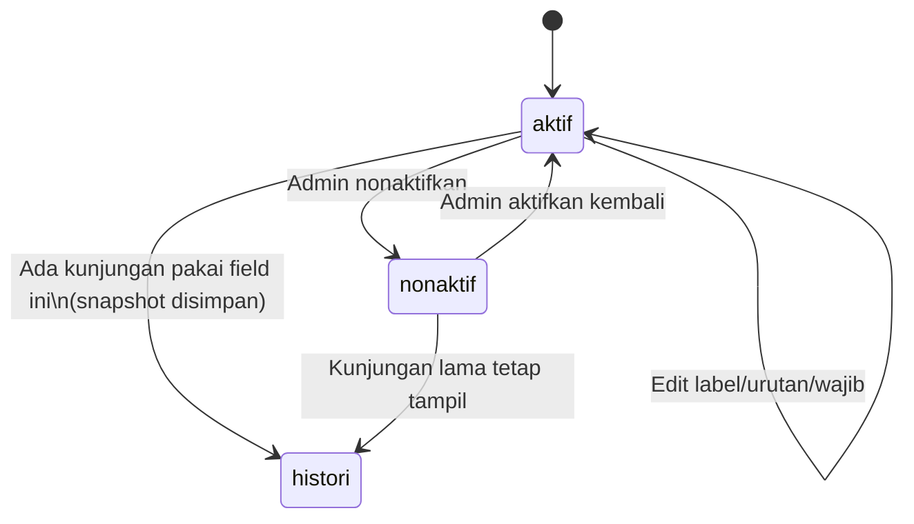

# W-B — Master Data & Definisi Field Fleksibel (Admin)

> Admin kelola Kelurahan → RW/RT → Posyandu → Kader → **Definisi Field 8 sasaran**. Kunci fleksibilitas: perubahan tanpa rebuild; kunjungan lama pakai snapshot.

## User Journey (Admin)

| Step | Aksi | Detail |
|---|---|---|
| 1 | Kelola Kelurahan | Ngemplakrejo, Tambaan, Trajeng, Mayangan + jumlah posyandu/target KK |
| 2 | Kelola RW/RT | Nomor RW/RT per kelurahan |
| 3 | Kelola Posyandu | Nama, kelurahan, kader tugas, jadwal kegiatan |
| 4 | Kelola Kader/Pengguna | Nama, role, posyandu/wilayah binaan, No HP, kredensial |
| 5 | Definisi Field | Per kelompok: nama, label, bagian, sasaran, tipe (pilihan/angka/tanggal/checkbox/teks), wajib/opsional, urutan, aktif/nonaktif |
| 6 | Simpan & Preview | Render preview form W-C |

Sumber 8 sasaran: Ibu Hamil, Bersalin & Nifas, Bayi 0–6, Balita 6–71, Sekolah/Remaja 6–18 ⭐, Dewasa 18–59, Lansia >60, TBC + Data Keluarga/Rekap/Tindak Lanjut/Jadwal.

## Diagram Mermaid — Flow



## Diagram Mermaid — State Field



## Skenario Gherkin

```gherkin
Feature: Master & Definisi Field Fleksibel

  Scenario: CRUD Kelurahan sukses
    Given login sebagai Admin
    When buat Kelurahan "Ngemplakrejo" + RW04/RT02
    Then tampil di daftar master dan bisa dipilih di Posyandu

  Scenario: Admin tambah field baru saat format Kemenkes berubah
    Given definisi "Tekanan darah" aktif untuk Dewasa
    When admin tambah field "Lingkar perut" tipe angka, wajib=false, urutan=5, aktif=true
    Then field muncul di form W-C kunjungan Dewasa baru tanpa deploy ulang

  Scenario: Nonaktifkan field histori tetap valid
    Given ada kunjungan lama memakai field "PMO" (TBC)
    When admin nonaktifkan "PMO"
    Then kunjungan lama tetap tampil snapshot "PMO", kunjungan baru tidak render field itu

  Scenario: Validasi duplikat nama field
    Given field "NIK" sudah ada di Data Keluarga
    When admin buat field "NIK" lagi di kelompok sama
    Then error "Nama field sudah ada" dan simpan diblok

  Scenario: Ubah urutan tampil
    Given field A urutan 2, field B urutan 5
    When admin drag B ke urutan 1
    Then preview dan W-C render urutan baru  B(1), A(3)...

  Scenario: Wajib/opsional mempengaruhi validasi W-C
    Given field "Tgl lahir" wajib=true
    When admin ubah jadi wajib=false dan simpan
    Then kunjungan baru boleh kosongkan tgl lahir tanpa error

  Scenario: Kader tidak bisa akses master
    Given login sebagai Kader
    When buka "/admin/definisi-field"
    Then 403 + redirect ke "/jadwal"
```

## Implikasi

- Rekap W-F menghitung dari field aktif + snapshot histori.
- Urutan & aktif/nonaktif mempengaruhi W-C render dinamis real-time (online).
