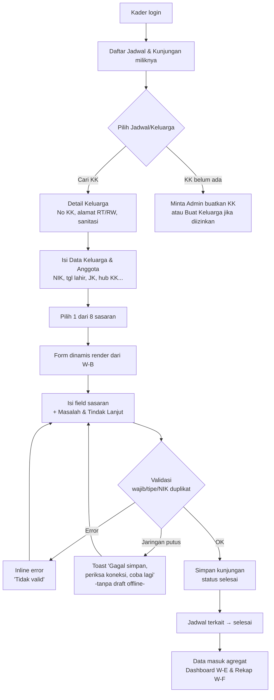
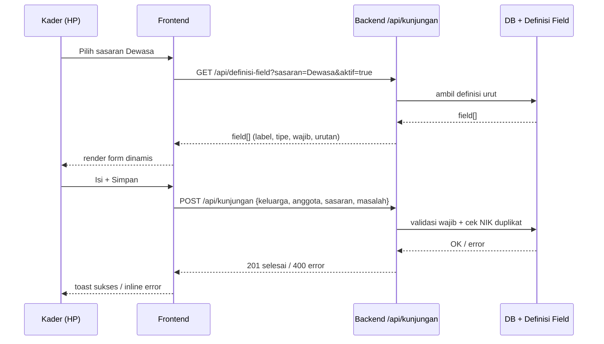
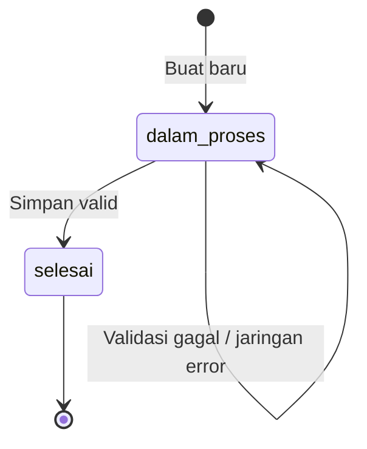

# W-C — Input Kunjungan Rumah Dinamis (Kader)

> Alur paling kritis. Form render dinamis dari W-B (8 sasaran + Data Keluarga). Mobile-first, online only, validasi wajib/opsional, 1 Jadwal → 1 Kunjungan.

## User Journey (Kader, HP, online)

| Step | Aktor | Aksi | Keluaran |
|---|---|---|---|
| 1 | Kader | Login → Daftar Jadwal/Kunjungan miliknya (filter posyandu/minggu) | List jadwal terjadwal + kunjungan selesai |
| 2 | Kader | Pilih Jadwal/Keluarga (cari KK: nama/No KK/RT/RW) | Detail KK |
| 3 | Kader | Isi Data Keluarga & Anggota (NIK, tgl lahir, JK, hub KK, pendidikan, pekerjaan, kelompok sasaran) | Data keluarga |
| 4 | Kader | Pilih 1 dari 8 sasaran | Form dinamis ter-render |
| 5 | Kader | Isi field sasaran (mis. Dewasa: periksa setahun, terdiagnosa hipertensi/DM, ada obat, minum 24 jam; BaHa, suhu, buku KIA, edukasi, paraf) | Draft isian |
| 6 | Kader | Tandai Masalah & Tindak Lanjut (nama, NIK, masalah, tindak lanjut, status belum/selesai/dirujuk) | Masalah |
| 7 | System | Validasi wajib/tipe + cek NIK duplikat (online) | OK / inline error |
| 8 | Kader | Simpan | Kunjungan `dalam_proses → selesai`, 1 Jadwal jadi selesai, data masuk agregat W-E/W-F |

8 sasaran: Ibu Hamil | Bersalin & Nifas | Bayi 0–6 | Balita 6–71 | Sekolah/Remaja 6–18 | Dewasa 18–59 | Lansia >60 | TBC.

## Diagram Mermaid — Flow Utama



## Diagram Mermaid — Sequence Simpan



## Diagram State Kunjungan



## Skenario Gherkin (7 inti)

```gherkin
Feature: Input KR Dinamis

  Scenario: Happy path hipertensi tidak patuh (kasus dashboard)
    Given keluarga KK-001 RT02/RW04 Ngemplakrejo dan anggota Dewasa "Budi" ada
    When kader isi Dewasa: terdiagnosa hipertensi=2025-08-01, ada obat=true, minum 24 jam=false
    And tandai Masalah "Hipertensi tidak patuh" dan Simpan
    Then kunjungan status selesai dan dashboard W-E hitung +1 hipertensi tidak patuh di RT02

  Scenario: Field wajib kosong diblok
    Given definisi "NIK" wajib=true di Data Keluarga
    When kader kosongkan NIK dan tekan Simpan
    Then inline error "NIK wajib diisi" di field NIK dan simpan gagal

  Scenario: NIK duplikat ditolak online
    Given NIK "357801..." sudah ada di anggota lain
    When kader pakai NIK sama dan Simpan
    Then error async "NIK sudah terdaftar" dan simpan diblok

  Scenario: Keluarga belum di-master
    Given KK "Siti" belum ada di master
    When kader cari "Siti" tidak ketemu
    Then tampil CTA "Minta Admin buatkan KK" dan opsi Buat Keluarga (jika diizinkan)

  Scenario: Definisi berubah saat mengisi
    Given kader sedang isi Bayi 0–6
    When admin ubah definisi field Bayi di sesi lain
    Then toast "Definisi diperbarui, muat ulang" dan form re-render terbaru sebelum simpan

  Scenario: Anggota masuk 2 sasaran sekaligus
    Given Balita "Ani" umur 5 thn juga kontak TBC
    When kader selesai isi Balita 6–71 dan Simpan
    Then bisa Tambah Penilaian TBC untuk Ani di kunjungan sama (2 penilaian, 1 kunjungan)

  Scenario: Error jaringan online only
    Given koneksi putus saat Simpan
    When tekan Simpan
    Then toast "Gagal simpan, periksa koneksi, coba lagi" dan tidak ada draft lokal
```

## Catatan

- Jenis kunjungan rutin 1×/tahun vs khusus door-to-door mempengaruhi filter W-E.
- BaHa, suhu, buku KIA, edukasi, paraf = pola berulang per sasaran (template field W-B).
- Error jaringan = retry, bukan queue offline (keputusan 10 Sep).
