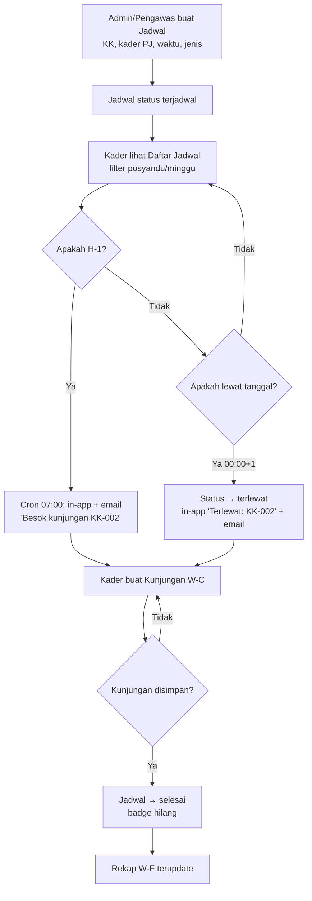
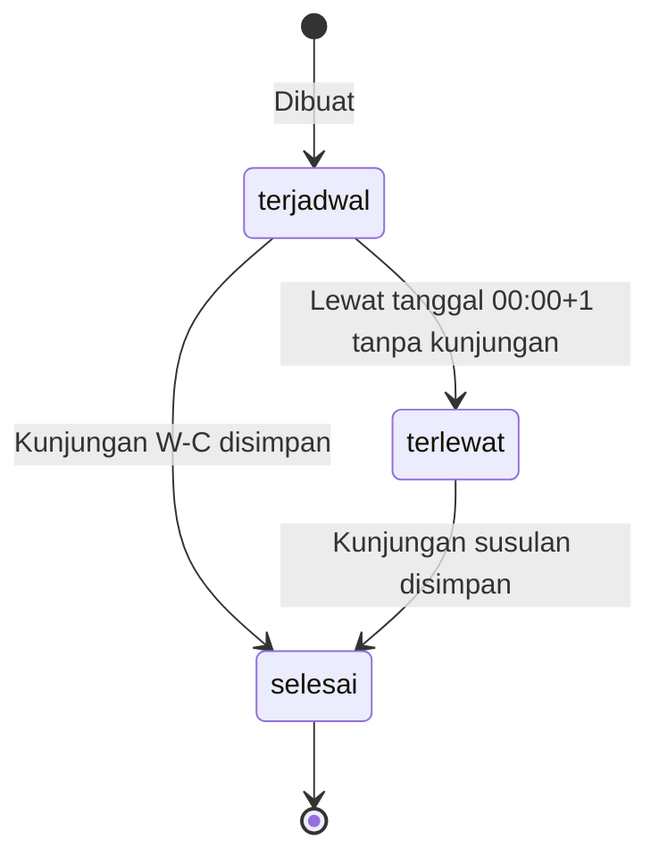

# W-D — Jadwal & Pengingat (Kader + System)

> Jadwal KR (dusun, RT/RW, nama KK, waktu, kader PJ) → status `terjadwal/selesai/terlewat` → in-app + email. 1 Jadwal → 1 Kunjungan (W-C).

## User Journey

| Step | Aktor | Aksi | Keluaran |
|---|---|---|---|
| 1 | Admin/Pengawas | Buat Jadwal (pilih KK, kader PJ, waktu, jenis rutin/khusus) | Jadwal `terjadwal` |
| 2 | Kader | Lihat Daftar Jadwal miliknya (filter posyandu/minggu/kelurahan) | List jadwal |
| 3 | System (cron) | Cek H-1 & terlewat (00:00+1) | Trigger notifikasi |
| 4 | System | Kirim in-app badge + email ("Besok: KK-002" / "Terlewat: KK-002") | Notifikasi |
| 5 | Kader | Buat Kunjungan W-C untuk KK tersebut → Simpan | Jadwal → `selesai`, badge hilang |
| 6 | Pengawas | Lihat Rekap jadwal per minggu/wilayah (W-F) | Monitor keterlambatan |

## Diagram Mermaid — Flow



## Diagram State Jadwal



## Skenario Gherkin

```gherkin
Feature: Jadwal & Pengingat in-app + email

  Scenario: Jadwal H-1 kirim pengingat
    Given jadwal KK-002 untuk kader A tgl 2026-09-20 jenis rutin
    When cron jalan jam 07:00 H-1 (2026-09-19)
    Then in-app badge "1" + email ke kader A "Besok kunjungan KK-002 RT02/RW04"

  Scenario: Jadwal terlewat
    Given jadwal 2026-09-10 untuk KK-003 tanpa kunjungan
    When cron jam 00:00 tgl 2026-09-11
    Then status jadi terlewat dan in-app "Terlewat: KK-003" + email terlewat

  Scenario: Tandai selesai via kunjungan
    Given jadwal terlewat untuk KK-003
    When kader buat kunjungan untuk KK-003 dan Simpan sukses
    Then jadwal otomatis jadi selesai dan badge terlewat hilang

  Scenario: Filter jadwal per posyandu
    Given ada 20 jadwal di 4 kelurahan
    When kader filter Posyandu=Ngemplakrejo
    Then hanya tampil jadwal Ngemplakrejo miliknya

  Scenario: Pengawas lihat keterlambatan
    Given 5 jadwal terlewat di Tambaan minggu ini
    When pembina buka Rekap jadwal
    Then tampil "Terlewat: 5" dan drill-down per kader/KK
```

## Catatan

- v1 hanya in-app + email free-tier; WhatsApp di luar v1 (PRD Di Luar Cakupan).
- Cron asumsi online; jika server down, notifikasi tertunda tanpa queue offline kader.
