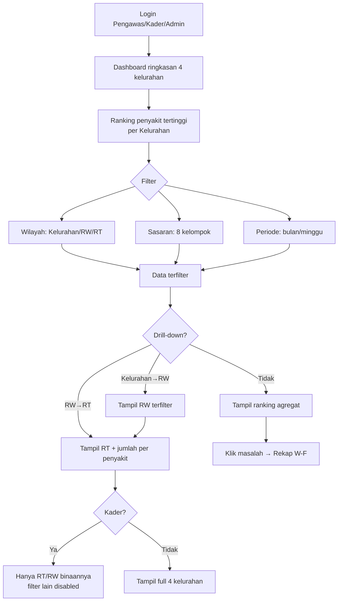
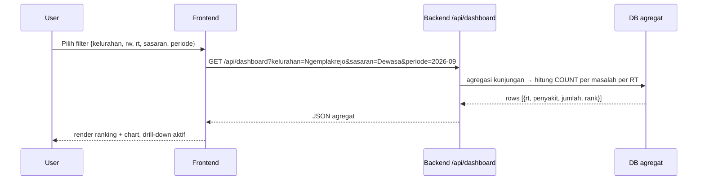

# W-E — Dashboard PWS (Pemantauan Wilayah Setempat)

> Inti: ranking penyakit/masalah tertinggi per Kelurahan→RW→RT, filter wilayah/sasaran/periode, drill-down, akses per role.

## User Journey

| Step | Aktor | Aksi | Keluaran |
|---|---|---|---|
| 1 | Pengawas | Login → Dashboard ringkasan 4 kelurahan | Card per kelurahan (total KK, total masalah) |
| 2 | Semua | Lihat ranking penyakit tertinggi per wilayah (contoh: hipertensi tidak patuh) | List peringkat + jumlah |
| 3 | Semua | Filter: Kelurahan, RW/RT, Kelompok sasaran (8), Periode (bulan/minggu) | Data terfilter |
| 4 | Semua | Drill-down Kelurahan → RW → RT | Detail RT + chart |
| 5 | Kader | Buka dashboard | Hanya wilayah binaannya, filter kelurahan lain disabled |
| 6 | Pengawas | Klik masalah → lihat Rekap W-F / tindak lanjut | Navigasi ke Rekap |

Aturan akses: Kader = wilayah sendiri; Pengawas/Admin = 4 kelurahan.

## Diagram Mermaid — Flow



## Diagram Mermaid — Sequence Filter



## Skenario Gherkin

```gherkin
Feature: Dashboard PWS per RT/RW/kelurahan

  Scenario: Drill-down hipertensi per RT
    Given ada 18 kunjungan Dewasa hipertensi tidak patuh di RT02/RW04 Ngemplakrejo periode 2026-09
    When pembina filter Kelurahan=Ngemplakrejo, Sasaran=Dewasa, Periode=2026-09
    And drill-down RW04 → RT02
    Then tampil "Hipertensi tidak patuh: 18 — peringkat 1" di RT02 dan chart batang

  Scenario: Kader hanya lihat wilayahnya
    Given kader Ngemplakrejo RT02 login
    When buka dashboard
    Then hanya tampil data RT02/RW04 Ngemplakrejo, filter kelurahan lain disabled dan GET 4 kelurahan diblok 403

  Scenario: Filter kosong empty state
    Given filter Periode=2025-01 (belum ada kunjungan)
    When terapkan filter
    Then empty state "Belum ada kunjungan pada periode ini" + CTA "Buat Kunjungan" jika role Kader

  Scenario: Agregat anonim tanpa NIK
    Given kunjungan Budi (NIK 357...) hipertensi tidak patuh
    When dashboard render ranking
    Then hanya hitung agregat, tidak tampil NIK/nama di card peringkat (klik untuk rekap anonim)

  Scenario: Filter sasaran TBC
    Given 5 kunjungan TBC (batuk >2 minggu) di Tambaan
    When filter Sasaran=TBC
    Then ranking TBC tampil dan drill-down RW/RT Tambaan aktif

  Scenario: Periode mingguan
    Given kunjungan minggu ke-2 September 2026
    When filter Periode=2026-W37
    Then agregat hanya hitung kunjungan minggu itu
```

## Catatan

- Agregat = `COUNT` per masalah per RT/RW/kelurahan dari W-C (field `ada obat` + `minum 24 jam` untuk hipertensi tidak patuh Dewasa/Lansia).
- Performance: pagination/lazy untuk data besar (ratusan KK) — polish C8.
- Tren YoY belum di v1; hanya periode filter.
