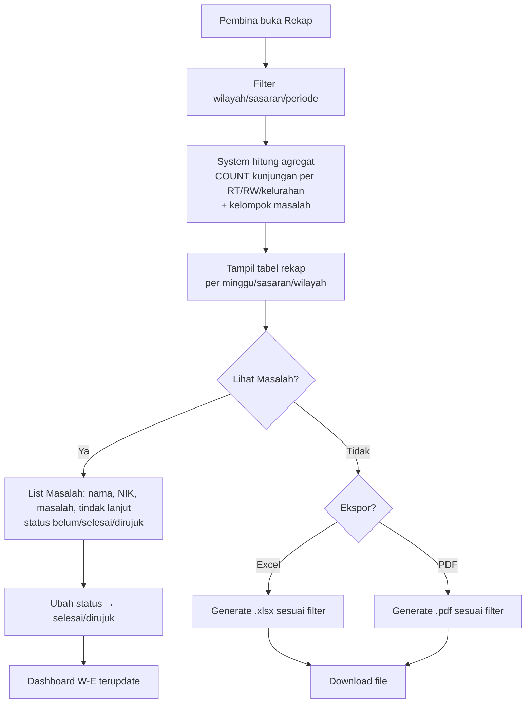
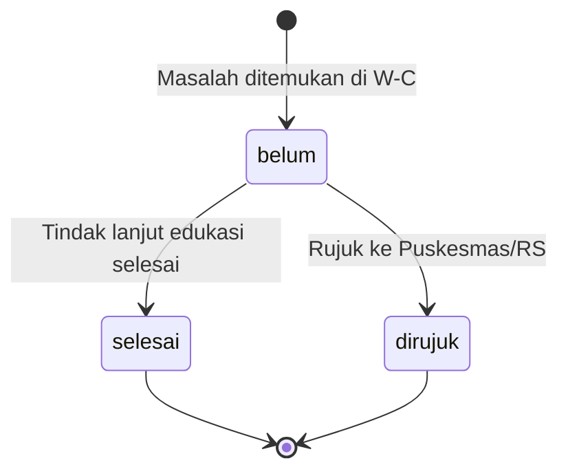

# W-F — Rekap, Masalah & Ekspor (Pembina/Admin)

> Rekap otomatis (agregat terhitung, bukan input manual) per minggu/sasaran/wilayah + Masalah (belum/selesai/dirujuk) + Ekspor Excel/PDF sesuai filter dashboard.

## User Journey

| Step | Aktor | Aksi | Keluaran |
|---|---|---|---|
| 1 | Pembina | Buka Rekap (default minggu ini, 4 kelurahan) | Tabel agregat per sasaran/wilayah + jumlah masalah |
| 2 | Pembina | Filter rekap (sama dengan W-E: wilayah/sasaran/periode) | Data terfilter |
| 3 | System | Hitung agregat: jumlah keluarga dikunjungi, per sasaran, dengan masalah (TBC, tidak minum obat, tanda bahaya) | Angka rekap |
| 4 | Pembina | Lihat Masalah & Tindak Lanjut (nama, NIK, masalah, tindak lanjut, status) | List masalah |
| 5 | Pembina | Ubah status Masalah → selesai/dirujuk | Update dashboard |
| 6 | Pembina | Klik Ekspor Excel/PDF | File sesuai filter |

## Diagram Mermaid — Flow



## Diagram State Masalah



## Skenario Gherkin

```gherkin
Feature: Rekap & Ekspor

  Scenario: Rekap otomatis mingguan
    Given 12 kunjungan minggu ke-2 September 2026 (5 Dewasa, 4 Balita, 3 Lansia) di Ngemplakrejo
    When buka Rekap periode 2026-W37
    Then tampil agregat terhitung: Dewasa 5, Balita 4, Lansia 3, dengan masalah 2, bukan input manual

  Scenario: Ekspor sesuai filter dashboard
    Given filter Dashboard = Kelurahan Ngemplakrejo + Sasaran Dewasa + Periode 2026-09
    When klik Ekspor Excel
    Then file .xlsx berisi hanya baris Ngemplakrejo Dewasa 2026-09 sesuai filter

  Scenario: Ekspor PDF
    Given filter Rekap = Tambaan minggu ini
    When klik Ekspor PDF
    Then file .pdf terdownload dengan header Puskesmas Trajeng + tabel rekap Tambaan

  Scenario: Masalah dirujuk update dashboard
    Given masalah TBC pada "Ani" status belum
    When pembina ubah jadi dirujuk
    Then dashboard W-E indikator "dirujuk" bertambah dan rekap masalah terupdate

  Scenario: Rekap historis tetap konsisten saat definisi berubah
    Given rekap September pakai field "Lingkar perut" baru
    When lihat rekap Agustus (sebelum field ada)
    Then rekap Agustus tidak hitung field baru, hanya snapshot field aktif saat itu

  Scenario: Kader tidak bisa ekspor
    Given login sebagai Kader
    When buka "/rekap"
    Then 403 atau tombol Ekspor hidden, hanya bisa lihat jadwal/kunjungan miliknya
```

## Catatan

- Rekap = agregat terhitung dari W-C (menggantikan Excel manual `Temuan Interview - Ekstraksi:40`).
- Ekspor mengikuti filter aktif (konsisten dengan W-E).
- Jika definisi field W-B berubah, rekap histori pakai snapshot (tidak merusak Agustus saat September tambah field).
